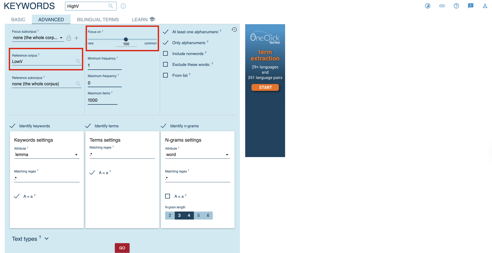
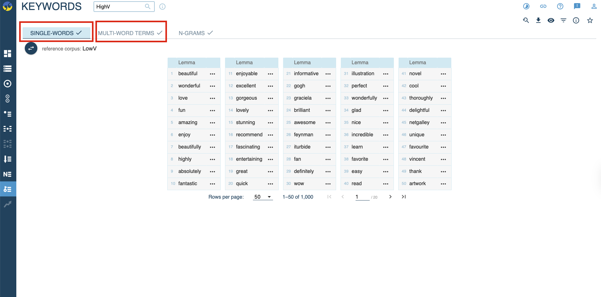

# Keyness Analysis

## Objectives

The objective of this experiment is to explore two research questions:

1. Do the readers combine reviews with emotions?
2. If so, what vocabularies do the readers use when leaving emotional book reviews?

## Method

The experiment consists of three main steps:

1. Predict emotional values (valence & arousal) of each book review entry;
   - **Tool:** [Multilingual_VA_prediction](https://github.com/gmendes9/multilingual_va_prediction) (Mendes & Martins, 2023);
2. Divide the full corpus into High-/Low-Valence/Arousal sub-corpora;
3. Run keyness analysis (statistical keyword extraction) on each sub-corpora;
   - **Tool:** [Sketch Engine](https://www.sketchengine.eu/);

## Procedure

### Valence & arousal prediction

Please see [Analysis/Emotion&Keyness/ValenceArousalAnalysis.ipynb](Analysis/Emotion&Keyness/ValenceArousalAnalysis.ipynb).

### Corpus division 

Since most of the reviews distributes with neutral valence and arousal (V & A value close to 0.5), the sub-corpus are divided by 25% percentile and 75% percentile.

- **High-Valence corpus:** Reviews with Valence value >= 0.6
- **High-Arousal corpus:** Reviews with Arousal value >= 0.55
- **Low-Valence corpus:** Reviews with Valence value <= 0.5
- **Low-Arousal corpus:** Reviews with Arousal value <= 0.49

### Keyness analysis

1. **Create the four corpus on Sketch Engine:** High-Valence, High-Arousal, Low-Valence, Low-Arousal.

2. For each corpus, choose **"Keywords"** analysis, select the corresponding **reference corpus**, and set **"Focus on"** to **100**. 

    - For **High-Valence corpus**, the reference corpus is **Low-Valence corpus**, and vise versa;
    - For **High-Arousal corpus**, the reference corpus is **Low-Arousal corpus**, and vise versal;

3. Retrieve the key **single-words** and **multi-word terms**. 

## Resulsts

Please see [Results/VA_Keywords](Results/VA_Keywords). 