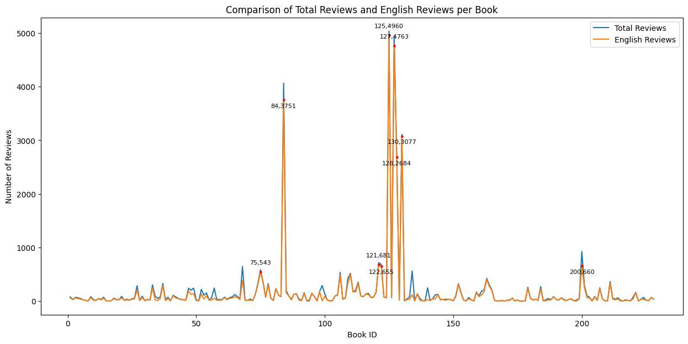

# 1. Masterdata base

To be finished.

# 2. Scraper

Please see the documentation for the scraper. It will be merged into this part later. 

# 3. Review Cleaning and Statistics

This step includes the cleaning and basic statistical analysis of the review dataset. All code is executed in the Jupyter Notebook file [Analysis/ScrapedReviewCleaningStatistics.ipynb](Analysis/ScrapedReviewCleaningStatistics.ipynb).

## 3.1 Initial Cleaning and Setup

### Initial Cleaning

The initial cleaning involves removing any potential duplicates in the scraped review files located in [Data/Reviews_Scraped/Raw](Data/Reviews_Scraped/Raw). Duplicates are identified based on two columns: `user_name` and `text`. A `remove_duplicates()` function has been created and applied to all files under the [Raw directory](Data/Reviews_Scraped/Raw).

### Books with No Reviews

Since the scraper skipped books without reviews, we compared the file list in the [Raw directory](Data/Reviews_Scraped/Raw) with the [metadata file](Data/Goodreads_Comics_Data/Data_Files/Masterdata_ongoing.xlsx) to identify the skipped books.

According to this comparison, 4 books were skipped due to having no reviews:

```
['59113162-one-bourbon-one-scotch-one-beer',
 '57553105-cypress-hill-tres-equis',
 '49930973-clayton',
 '63234758-growing-up-farley-a-chris-farley-story']
```

### Incomplete Review Scraping

According to the scraping logs, two books were not completely scraped due to Chrome's V8 engine running out of memory (OOM). The affected books are:

```
17346698-march: 5965 reviews, 5038 scraped

52211831-they-called-us-enemy: 6449 reviews, 4950 scraped
```

## 3.2 Filtering English Reviews Only

During the scraping stage, all reviews were collected without filtering to simplify the process. Therefore, a filtering step was necessary afterward.

Several Python packages can be used to detect language, but based on a comparison table from this [GitHub page](https://github.com/pemistahl/lingua-py), FastText appears to be the most suitable option for identifying English text across different levels (single word, word pair, and sentence). For this reason, the FastText model `lid.176.bin` was chosen for this task.

A custom `detect_language()` function was developed to return the most likely ISO language label for each review. This function was applied to all scraped reviews.

Before running the language detection, all newline characters (`\n`) were removed from the review texts.

English reviews are stored in the directory: [Data/Reviews_Scraped/En](Data/Reviews_Scraped/En).

## 3.3 Review statistics

### All review number & English review number

Having counted all reviews in the two directories, there are total 42,459 reviews scraped, in which 37,212 are English reviews. 

| Statistic | Review Number (All Languages) | Review Number (English) |
|-----------|-------------------------------|-------------------------|
| **Count** | 228                           | 228                     |
| **Mean**  | 186.22                        | 163.21                  |
| **Std**   | 601.75                        | 580.60                  |
| **Min**   | 0                             | 0                       |
| **25%**   | 19                            | 15                      |
| **50%**   | 51.50                         | 35.50                   |
| **75%**   | 127.50                        | 98.25                   |
| **Max**   | 5038                          | 4960                    |


There are **9** books that has over 500 English reviews. 

|book_id|goodreads_id|review_num_en|
|-------|------------|-------------|
|075    |50159157-glass-town|543|
|084    |13332696-my-friend-dahmer|3751|
|121    |15792872-feynman|681|
|122    |18465496-andre-the-giant|655|
|125    |17346698-march|4960|
|127    |52211831-they-called-us-enemy|4763|
|128    |22487952-march|2684|
|130    |29436571-march|3077|
|200    |32783833-hostage|660|



Review number statistics `review_num` and `review_num_en` are saved to the metadata base in sheet `BOOK_REVIEW_SHEET`.

⚠️ **All statistics and analysis afterwards are on English reviews only.**

### Review word number

#### Remove unusual characters

Before tokenizing and counting the word number for the reviews, the review texts should be cleaned. Human inspection has found that there are unusual characters appeared in the review dataset, such as unicode control characters, emojis, mathematical signals, etc. 

A `find_unusual_chars()` function has been created with the aid of `re` module to identify unusual characters from review text. The function has been applied to all review files. 

To betteer inspect the unusual characters to decide which ones should be removed, `unicodedata` module has been used to categorize the unusual characters. 

After human inspection, among all categories of unusual characters, only `Ll` is decided to be kept for the review dataset, which are un-Latin characters like 'в', 'â', 'ï', etc. All other unusual characters in the review dataset are deleted.

#### Tokenizing and word count

`nltk.TweetTokenizer` has been used to tokenize the reviews. `nltk.TweetTokenizer` was trained on social media data, and can idenitfy words like "can't" as one word (in other tokenizers, the word will be segmented to "ca" and "n't").

A `count_words()` function has been created and applied to all review files. An additional column of `word_count` has been created for each review file after the processing. 

The whole English review corpus contains **3,467,963 words**, and the average review lenght is **93.19 words**, according to the results. 

# 4. Tag Co-occurrence

## 4.1 Tag statistics

To get a overall impression of how the readers are tagging graphic biographies, we performed descriptive statistics on the all tags that has appeared in the scraped reviews. 

The tags and the frequencies are saved in [Data/Reviews_Scraped/tag_counter.csv](Data/Reviews_Scraped/tag_counter.csv).

There are overall 32,774 tags appeared in the dataset, with 6,482 unique tags. 

The most frequent tags are (appeared over 1,000 times):

| tag | frequency |
|-----|-----------|
|graphic-novels|3023|
|graphic-novel|2348|
|biography|1394|
|non-fiction|1124|
|comics|1061|
|history|1044|

## 4.2 Tag co-occurrence

If want to try dynamic and interactive network graph, can try D3.js 

[D3.js Tutorial](https://d3-graph-gallery.com/network)

Visualization tool: Gephi -- Force Atlas layout;

The cooccurrence of tags appeared over 10 times in the corpus: 


The cooccurrence of all tags:

